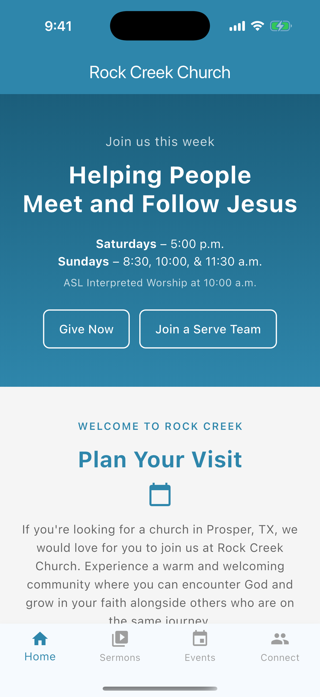
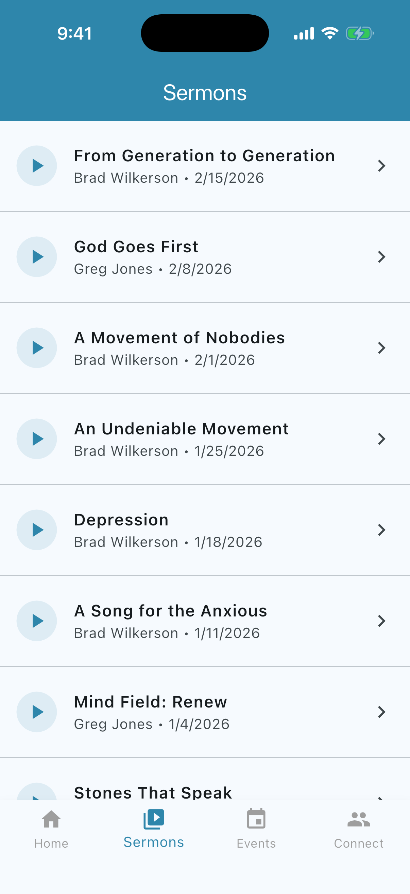
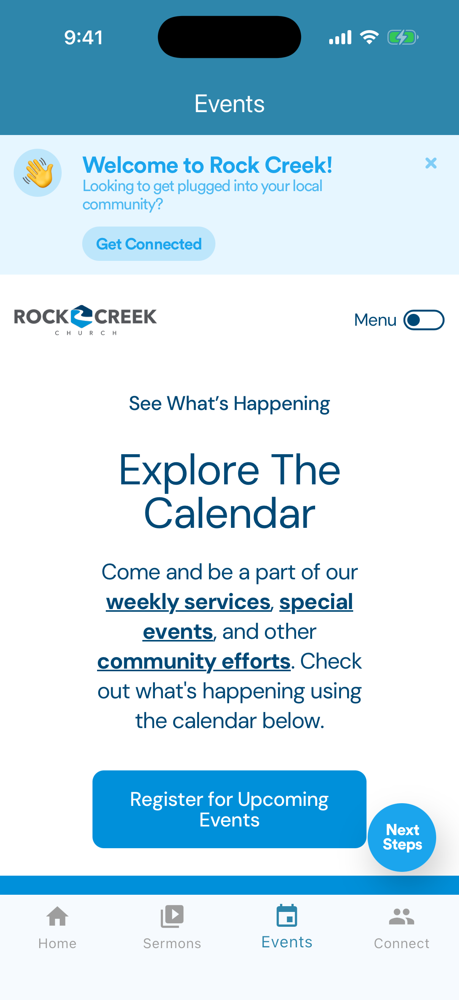
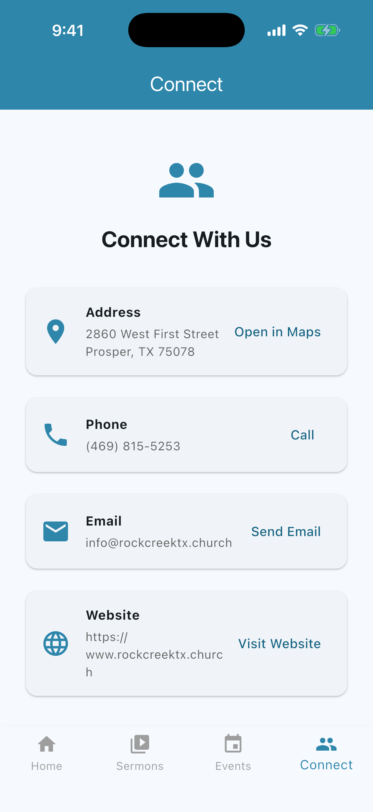
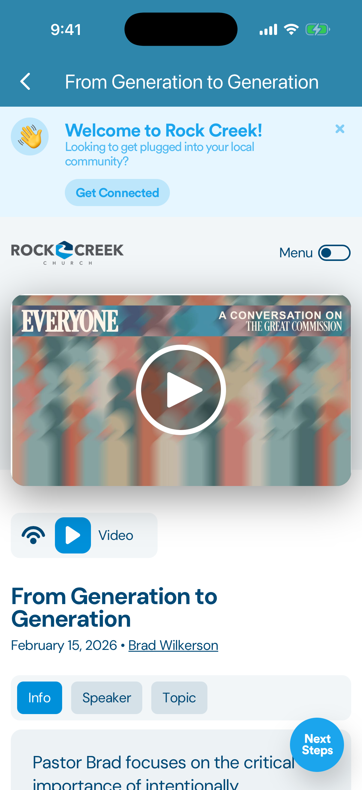

# Rock Creek Church App

A Flutter mobile app for [Rock Creek Church](https://www.rockcreektx.church/) in Prosper, TX. Displays live sermon data, church events, and contact information. Runs on both iOS and Android from a single codebase.

## Demo

[](https://youtu.be/tf092xomeJM)

## Screenshots

| Home | Sermons | Events | Connect | Sermon Detail |
|:----:|:-------:|:------:|:-------:|:-------------:|
|  |  |  |  |  |

## Features

- **Home** - Hero banner, service times, latest sermon, quick links, and CTAs matching the church website
- **Sermons** - Live sermon list pulled from the church website, with embedded YouTube video playback
- **Events** - Church events page displayed in a WebView
- **Connect** - Contact info with quick links to Maps, phone, email, and website

## How It Works

The app fetches sermon data directly from the Rock Creek website. The site is built on the Nucleus church platform, which embeds page data as a base64-encoded JSON blob (`window.__PRELOADED_STATE__`) in the server-rendered HTML. The app decodes this to extract sermon titles, dates, speakers, and YouTube video URLs -- no API keys or backend required.

## Getting Started

### Prerequisites

- [Flutter SDK](https://docs.flutter.dev/get-started/install) (stable channel)
- Xcode (for iOS) or Android Studio (for Android)

### Install Dependencies

```bash
flutter pub get
```

### Run on iOS Simulator

```bash
open -a Simulator          # Launch the iOS simulator
flutter run                # Run the app on it
```

For a **physical iPhone**, connect via USB and set your signing team in Xcode (`ios/Runner.xcworkspace` → Signing & Capabilities), then:

```bash
flutter devices            # Confirm the device is detected
flutter run -d <device-id>
```

### Run on Android Emulator

```bash
flutter emulators                      # List available emulators
flutter emulators --launch <name>      # Launch one
flutter run                            # Run the app on it
```

For a **physical Android device**, enable Developer Options and USB Debugging, connect via USB, then:

```bash
flutter devices
flutter run -d <device-id>
```

### Useful Commands

| Command | What it does |
|---------|-------------|
| `flutter devices` | List all connected devices and emulators |
| `flutter run` | Run on the default device |
| `flutter run -d <id>` | Run on a specific device |
| `flutter analyze` | Check for lint and compile errors |

## Project Structure

```
lib/
  config/
    app_config.dart       # Centralized URLs and church info
  models/
    sermon.dart           # Sermon data model
  services/
    api_service.dart      # HTML fetching and JSON parsing
  screens/
    home_screen.dart      # Home tab
    sermons_screen.dart   # Sermon list tab
    sermon_detail_screen.dart  # Sermon video playback
    events_screen.dart    # Events WebView tab
    connect_screen.dart   # Contact info tab
  widgets/
    loading_indicator.dart # Reusable loading spinner
  main.dart               # App entry point and navigation
```

## Configuration

### Updating URLs

All URLs are centralized in `lib/config/app_config.dart`. Update these if the church website changes:

```dart
static const String baseUrl = 'https://www.rockcreektx.church';
static const String sermonsUrl = '$baseUrl/sermons/';
static const String eventsUrl = '$baseUrl/events/';
```

### Changing App Colors

The app theme is defined in `lib/main.dart`. Update the `seedColor` and `primaryColor` values:

```dart
primaryColor: const Color(0xFF2E86AB),
colorScheme: ColorScheme.fromSeed(
  seedColor: const Color(0xFF2E86AB),
),
```

### Changing the App Name

1. **Android**: Edit `android/app/src/main/AndroidManifest.xml` (`android:label`)
2. **iOS**: Edit `ios/Runner/Info.plist` (`CFBundleDisplayName`)

### Updating HTML Selectors

If the Nucleus platform changes how it embeds data, the parsing logic is in `lib/services/api_service.dart`. Key areas:

- `_preloadedStateRegex` - Regex to extract the base64 state from HTML
- `_parseSermonsFromState()` - Walks `queryState.queries` for sermon entries
- `_parseVideoUrlFromState()` - Finds YouTube URLs in `mediaItems`

## Dependencies

| Package | Purpose |
|---------|---------|
| `http` | HTTP requests to fetch page HTML |
| `html` | HTML parsing (available if needed for fallback) |
| `webview_flutter` | Embedded YouTube video and events page |
| `url_launcher` | Open Maps, phone, email, and web links |

## Live vs. Static Content

Some content updates automatically from the church website; other content is hardcoded and requires a code change.

### Updates automatically
- **Sermons list** — fetched live from `rockcreektx.church/sermons/` on every load
- **Latest sermon on Home** — pulled from the same sermon API, always shows the newest sermon
- **Events tab** — WebView loading the church website's events page directly
- **Sermon video playback** — loads the church's own sermon detail page in a WebView

### Requires a code update
- **Service times** — hardcoded in `lib/screens/home_screen.dart`
- **Home screen text** — hero copy, Plan Your Visit paragraph, section descriptions
- **Contact info** — address, phone, email in `lib/config/app_config.dart`
- **CTA button URLs** — `/give`, `/serve`, `/plan-your-visit`, etc. in `lib/config/app_config.dart`

## What's Not Included (Phase 1)

- Push notifications
- Firebase / analytics
- YouTube API usage
- Payment / giving integration
- Authentication
- Offline caching
- Admin backend
- App Store publishing
